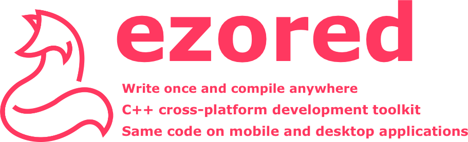

# ezored core




[](https://travis-ci.com/ezored/ezored-core)
[](https://ci.appveyor.com/project/PauloCoutinho/ezored-core)

## About

**Write once and compile anywhere**

C++ cross-platform development toolkit.

Use the same code on mobile and desktop applications.

Ezored is the most convenient and fatest way to start your C++ project for mobile and desktop.

## Core

Ezored **core** has the main scripts for **ezored** project.

It is separated from **ezored** main project to let developers use the **core** project into any other project without **ezored** main project.


## Requirements:

**The general requirements is:**

1. Python (https://www.python.org/)

Obs: Some particular commands require theirs internal tools, but is optional (ex: clang command use clang-format tool). You can always ignore any command or create others in the current structure.

## How to use:

1. Create your project folder, example **ezored**:

    > mkdir ezored

2. Enter on cloned folder:
    > cd ezored

3. Clone reposity:
    > git clone git@github.com:ezored/ezored-core.git

4. Create a file called **"make.py"** in root folder like in main **ezored** project:
    > https://github.com/ezored/ezored/blob/master/make.py
      
    You can use on some systems:  
    ```curl -O https://raw.githubusercontent.com/ezored/ezored/master/make.py```    

5. Create folder **files**, because **ezored** always search for it to get source files, targets etc:

    > mkdir files

6. Create **targets** like in main **ezored** project as you need:
    https://github.com/ezored/ezored/tree/master/files 

## Supported By Jetbrains IntelliJ IDEA


## License

[MIT](http://opensource.org/licenses/MIT)

Copyright (c) 2019-present, Paulo Coutinho
